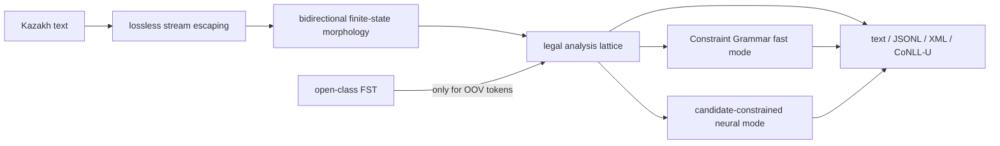

# KazStem

[](https://github.com/amir-nuriyev/KazStem/releases)
[](https://www.python.org/)
[](LICENSE)

[**Try KazStem in your browser**](https://amir-nuriyev.github.io/KazStem/)
— a zero-install, client-only lattice-analysis proof of concept with local file
upload, offline caching, and no analytics or server-side text processing. The
page names its current parity limits and leaves unsupported contextual and
generation modes disabled.

**KazStem** is an ambiguity-preserving morphological analyzer and generator for
Kazakh. Its primary command is `kazstem`; the compatibility commands
`qazmorph` and `mystem-kz`, and the existing Python import package `qazmorph`,
remain available. KazStem exposes a MyStem-like command-line interface and a
typed Python API, but its implementation is independent of MyStem.

## Features

- lossless Unicode tokenization with exact character offsets and reconstruction;
- complete finite-state analysis lattices for known Kazakh words;
- formally bounded productive noun, adjective, and verb hypotheses for OOV words;
- lemma, UPOS, UD features, ordered raw tags, morphemes, provenance, and scores;
- fast candidate-constrained Constraint Grammar disambiguation that can abstain;
- optional Stanza-based neural ranking that cannot invent analyses outside the FST;
- dictionary generation from exact `(lemma, tags)` analyses;
- MyStem-style positional files and `-n/-c/-w/-l/-i/-g/-s/-e/-d` options;
- text, MyStem-shaped JSON/XML, lossless JSONL v2, and CoNLL-U output;
- JSONL/TSV fixlists, grammar filtering, Unicode normalization, and bounded OOV caching;
- reproducible, content-addressed resources with formal graph, provenance, and
  post-run integrity verification;
- versioned evaluation and performance reports with explicit coverage,
  abstention, alignment, and completeness accounting.
- SHA-locked native-runtime manifests for public binary bundles, with the
  resource build toolchain and the active platform runtime reported separately.

The production core is hybrid:



- The finite-state lexicon and two-level morphophonology come from the
  independently licensed [`apertium-kaz`](https://github.com/apertium/apertium-kaz)
  project at a pinned commit.
- Known words retain every distinct raw/morpheme reading, even when several
  readings collapse to the same lossy UD projection.
- Version 0.2 makes the consuming surface partition strictly atomic: every
  whitespace run is a separate gap token and no lexical token contains
  Unicode whitespace. Dictionary expressions such as `жоқ қой` remain fully
  available as immutable, overlapping `AnalysisSpan` lattice records, so
  fixing tokenization never discards their original raw candidates.
- An isolated productive FST proposes noun, adjective, and verb analyses for
  unseen NFC Kazakh-Cyrillic stems of at most 32 code points, excluding
  three-or-more-character elongation/noise runs. The unknown lemma must
  identity-copy a nonempty surface prefix before entering one of the upstream
  N1, A1, V-TV, or V-IV continuations. The only nonidentity root paths are one
  explicitly bounded stem-final п→б, к→г, or қ→ғ voicing pair after a nonempty
  identity prefix. A formal build gate rejects every reachable input-epsilon
  cycle. Output is capped, ranked, and cached; it never
  adds speculative readings to dictionary words. Non-Kazakh/overlong OOVs
  deterministically receive an explicit unknown analysis. A timed-out, failed,
  or cyclically truncated lookup discards its incomplete output, warns once for
  that cached OOV, and likewise falls back to explicit unknown. That negative
  result is cached only for the lifetime of its `Analyzer`; a new instance
  retries the lookup.
- Fast contextual mode applies Kazakh Constraint Grammar and retains ambiguity
  when the grammar cannot justify a unique answer.
- Optional neural mode uses a Kazakh contextual model only to rank candidates
  licensed by the FST. CLI `--format jsonl` emits versioned consuming token
  records and non-consuming analysis-span records with every visible candidate
  and selected index; `-c` is still required to include nonlexical token rows.
- The same grammar generates surface forms from an exact lexical analysis.

## Correctness contract

No analyzer can truthfully guarantee 100% correctness for every possible
Kazakh sentence: real homonymy, annotation disagreement, code-switching, names,
typos, and new vocabulary make that claim ill-defined. This project uses three
testable guarantees instead:

1. All enabled tests in the versioned regression suite pass; any intentionally
   skipped contract is named as an unsupported limitation in the results.
2. Every compiled generator pair is accepted by the analyzer, enforced by the
   formal build gate `generation - analysis = ∅`. Corpus diagnostics,
   genuinely held-out evaluations, and performance are reported separately.
3. The productive analyzer is finite-valued for every finite surface: the
   compiled graph has no reachable input-epsilon cycle, and immutable no-cap
   probes must complete without HFST's cycle marker while retaining all four
   configured open-class continuations.

Unweighted FST readings have `score: null`. KazStem does not invent
probabilities from lexicon order. OOV and neural scores are normalized only
within their returned candidate lattice.

## Reproducible reference build

The repository contains source code rather than compiled Kazakh FSTs or neural
weights. The audited bootstrap currently targets Ubuntu 24.04 on x86-64 and
installs an unprivileged, version-locked HFST/CG toolchain under the checkout.

```bash
git clone https://github.com/amir-nuriyev/KazStem.git
cd KazStem
bash scripts/bootstrap_h100.sh
export QAZMORPH_RESOURCE_DIR="$PWD/.qazmorph/resources"
export PYTHONPATH="$PWD/src"
python3 -m unittest discover
```

The bootstrap uses pinned `apertium-kaz` source and exact Ubuntu package
versions to install an unprivileged HFST/CG toolchain under `.qazmorph/`. It
does not require `sudo`. Every downloaded Debian archive is checked against a
checked-in filename/package/version/architecture/size/SHA-256 lock before it is
extracted; every extracted toolchain file, build input, and output is then
SHA-256 manifested. The build also formally proves that the generator relation
is a subset of the analyzer relation by requiring `generation - analysis` to be
empty. Compiled resources live in an immutable content-addressed directory;
`.qazmorph/resources` is atomically switched only after the new bundle verifies.
Earlier complete bundles are kept for inspection or functional rollback.
Resource-manifest v2 bundles retain their legacy cyclic standard-lookup
guesser, so QazMorph deliberately disables productive OOV guessing for them
and returns explicit unknowns instead. Manifest v3 bundles require the embedded
finite-relation proof and use the optimized `.hfstol` guesser.

Runtime verification re-hashes every compiled resource artifact and every file
and symlink in the extracted HFST/CG toolchain. Official runs require both
content-addressed bundles to be sealed read-only and reject an unverified
executable override. It is not a byte-closed operating-system image: ELF
dependencies supplied by the H100 host (for example libc and ICU) remain
outside that manifest. Reports record this boundary as `byte_closed: false`,
the host platform, and whether ambient `LD_LIBRARY_PATH`, `LD_PRELOAD`, or
`LD_AUDIT` made the run non-official; `LD_PRELOAD`/`LD_AUDIT` values are hashed
rather than exposed.
Legacy v2 resources remain usable through standard lookup, but are labeled
non-official because their historical toolchain was not sealed read-only.

Version 0.2.2 also supports a detached native runtime shipped beside an exact
resource bundle. `src/qazmorph/platform_runtime_assets.lock.json` binds the
platform, resource bundle ID, native-runtime bundle ID, and manifest bytes.
Selection never searches a user cache or ambient `PATH`: it is restricted to
the content-addressed `.qazmorph/platform-runtimes/` directory beside the
verified resources and fails closed after a matching lock record exists. The
f03e resource manifest remains byte-for-byte unchanged and continues to report
the Ubuntu r4 toolchain that built it; runtime provenance separately reports
the active macOS arm64 identity. macOS helpers use bundle-relative Mach-O
rpaths, and ambient `DYLD_LIBRARY_PATH` or `DYLD_INSERT_LIBRARIES` makes a run
non-official. Native assets are platform-specific and their release notes state
the tested OS/architecture and signing status.

For packaged source and Python-wheel downloads, see
[GitHub Releases](https://github.com/amir-nuriyev/KazStem/releases). The wheel
installs the `kazstem`, `qazmorph`, and `mystem-kz` console commands. A complete
analysis run also needs the verified HFST/CG toolchain and compiled Kazakh
resource bundle described above; release assets state their platform and
runtime requirements explicitly.

Optional neural mode:

```bash
bash scripts/bootstrap_neural_h100.sh
.qazmorph/neural-venv/bin/qazmorph --neural -cin <<'EOF'
Қазақстанның кітаптарымыздан жазбағанбыз.
EOF
```

Neural setup is similarly staged. It locks the `uv` executable, every Kazakh
Stanza model file by byte size and SHA-256, the project sources, and exact
versions for the selected venv and host packages named in the lock. It also
checks the declared Python/Torch/CUDA host runtime and records every Python
distribution visible to the resulting interpreter. This is not a byte-for-byte
wheel-locked closure: the venv inherits system site packages, unselected visible host
dependencies are recorded rather than locked, and dependency wheel bytes are
not pinned. The active model and environment links move only after their
manifests verify. The active venv and verified model bundles remain under the
checkout's `.qazmorph/` directory; ephemeral installer caches are not runtime
inputs.

## CLI

The invocation follows MyStem's file convention:

```text
kazstem [options] [input-file] [output-file]
```

Omitted filenames and `-` mean standard input/output.

```bash
printf 'Қазақстанның кітаптарымыздан.' \
  | kazstem -cin --weight

printf 'Оқу инемен құдық қазғандай.' \
  | kazstem -d --format jsonl

printf 'Оқу инемен құдық қазғандай.' \
  | .qazmorph/neural-venv/bin/kazstem --neural --format conllu
```

Important options:

| Option | Meaning |
|---|---|
| `-n` | one emitted segment per line |
| `-c` | retain gaps and punctuation |
| `-w` | dictionary readings only |
| `-l` | omit surface forms in text output |
| `-i` | include UPOS and UD features |
| `-g` | merge readings sharing a lemma; requires `-i` |
| `-s` | emit text `{\s}` or XML sentence boundaries; requires `-c` |
| `-d` | apply Constraint Grammar; unresolved ambiguity remains visible |
| `--neural` | contextually rank the legal FST lattice |
| `--format text\|json\|jsonl\|xml\|conllu` | select output format |
| `--fixlist PATH` | override entries with JSONL or three-column TSV |
| `--filter-gram TAG[,TAG]` | require raw tags, UPOS, or `Feature=Value` |
| `--generate-all` | retain up to 256 safety-bounded OOV hypotheses |
| `--weight` | display scores when a scoring layer actually supplied them |
| `--ud-profile universal\|ktb` | select the UD view; `ktb` is explicit corpus compatibility |

`json` is the compact MyStem-shaped schema (`text`, `analysis`, `lex`, optional
`gr`/`qual`/`wt`): an array by default and one object per line with `-n`.
`jsonl` is QazMorph's richer `qazmorph.jsonl-record.v2` schema. Every row has
`record_type: token|analysis_span` and `consumes_input`. Token rows carry exact
offsets, raw tags, projection-profile provenance, all candidates, and selection; span rows retain
overlapping multi-token FST cohorts without consuming the surface twice. Use
`-c` (and do not use `-w`) when consuming token rows must reconstruct the full
input; without `-c`, nonlexical token rows are omitted. Span records remain
available whenever their filtered candidate set is nonempty.
Physical line endings are retained in MyStem text mode even without `-c`.
XML output validates every emitted text and attribute value against XML 1.0;
forbidden controls such as NUL produce a controlled error. Text, JSON, and
JSONL remain lossless for those caller code points.

The precise option-by-option contract, including deliberately unsupported
combinations, is in
[docs/MYSTEM_COMPATIBILITY.md](docs/MYSTEM_COMPATIBILITY.md).

## Python API

```python
from qazmorph import Analyzer

with Analyzer(
    resource_dir=".qazmorph/resources",
    ud_profile="universal",
) as analyzer:
    document = analyzer.analyze("Қазақстанның кітаптарымыздан")

    for token in document.tokens:
        for reading in token.analyses:
            print(token.text, reading.lemma, reading.upos, reading.feature_map)

    for span in document.analysis_spans:
        print(span.text, span.start, span.end, [r.raw for r in span.analyses])

    assert "кітаптарға" in analyzer.generate("кітап", ["n", "pl", "dat"])
```

Every token or analysis-span reading retains:

- exact surface offsets and optional NFC-normalized surface;
- lemma, lexical UPOS, ordered raw tags, and raw FST reading;
- every joined morpheme with its own UPOS/features;
- a legal UD v2 projection;
- provenance (`lexicon`, `guesser`, `fixlist`, deterministic `rule`, or
  `unknown`);
- nullable score and explicit guessed/orthographic flags;
- a separate contextual UPOS when syntax changes lexical `VERB` to `AUX`.

The default `universal` profile retains the legal UD distinctions supported by
the raw tags. The opt-in `ktb` profile changes only the lossy UD view to match
Kazakh-KTB conventions. `Document.ud_profile` and JSONL record which projection
was used; raw readings and morphemes remain unchanged.

On consuming atomic tokens, explicit raw usage tags can license additive UD
candidates without weakening the primary projection: `adj+subst → NOUN`,
`n+attr → ADJ`, and `adj+advl → ADV`. Compiled bare-decimal `<num>` readings
similarly receive an ordinal view, plus KTB's combined `Card,Ord` view only in
the `ktb` profile. Original FST candidates remain the stable prefix; these
rule-projection aliases never create OOV coverage or force an otherwise
unresolved top-1 choice. Non-consuming phrase spans remain the exact backend
raw lattice and provenance sequence.

See [docs/CONTRACT.md](docs/CONTRACT.md) for the schema and edge-case rules.

## Evaluation and performance

The official public annotated corpus is UD Kazakh-KTB (CC BY-SA 4.0). It is
small—1,078 sentences and 10,536 syntactic words—and its maintainers recommend
merging its files and using ten-fold jackknife evaluation instead of treating
the filenames as a canonical train/test split. Full-corpus FST and CG results
are diagnostics, not held-out claims: KTB's morphology follows Apertium
principles, and this project uses Apertium resources. The packaged Stanza
Kazakh models are themselves KTB-trained, so a neural score on full KTB has
training overlap and is reported only as a contaminated diagnostic. The
official 31-sentence `train` sample can serve as a tiny Stanza-unseen audit, but
it is still KTB and is not independent gold. The evaluator keeps alignment
failures in the end-to-end denominator. Evaluator v4 reports lattice recall,
lexical selected top-1, and neural context-projected UD top-1 separately because
only the lexical selected fields are candidate-recall-bounded.
An official neural report additionally requires the checked-in model and live
environment manifests to re-verify, the selected model bundle to match the
environment, and requested CPU/GPU placement to match the actual pipeline.

```bash
python3 scripts/evaluate_ud.py \
  --resource-dir "$QAZMORPH_RESOURCE_DIR" \
  .qazmorph/evaluation/UD_Kazakh-KTB-r2.18/kk_ktb-ud-*.conllu

python3 scripts/benchmark.py \
  --resource-dir "$QAZMORPH_RESOURCE_DIR" \
  --runs 20
```

See the [verified H100 results](benchmarks/RESULTS.md),
[benchmark instructions](benchmarks/README.md), and
[evaluation protocol](docs/EVALUATION.md). Corpus/model payloads and detailed
machine-readable reports are retained outside the source repository; the
checked-in results page records their aggregate metrics and immutable hashes.

## Data policy

The 25 GB Multidomain Kazakh Dataset is raw text rather than morphological gold.
It is useful for frequency estimates, OOV mining, domain robustness, and
throughput workloads, but it must not be presented as correctness labels.
`scripts/prepare_multidomain_sample.py` streams a revision-pinned prefix on the
evaluation host and writes a content manifest; `scripts/evaluate_raw.py` then measures
lossless reconstruction, operational coverage, bounded-OOV diagnostics, and
throughput without inventing gold accuracy. Keep the payload out of the source
repository and audit upstream component licenses independently before any
redistribution.

## Scope and limitations

- The current primary orthography is Kazakh Cyrillic. Digits, punctuation,
  abbreviations, and many Latin proper names are covered. Arabic-script Kazakh
  needs the upstream transliteration composition and is not claimed yet.
- Constraint Grammar is high precision but intentionally abstains when rules do
  not decide. Neural mode is optional and must earn its place on genuinely
  independent held-out data.
- CoNLL-U export emits only atomic, non-whitespace FORM rows and does not encode
  overlapping whitespace-MWE spans or expand joined morphemes into
  multiword-token rows. The upstream readings do not expose reliable morpheme
  surface spans. JSONL v2 retains the complete token and phrase-span lattice;
  use `-c` without `-w` when consuming rows must reconstruct the input.
- `--generate-all` remains safety bounded to keep API response size predictable,
  even though the productive analyzer is formally finite-valued per input.
- Productive OOV lookup retains at most the first 512 raw FST readings (2,048
  for `--generate-all`) and has a two-second complete-query bound. Reaching an
  explicit reading/byte cap retains that deterministic prefix; a wall-clock
  timeout or HFST cycle marker never exposes a partial lattice.
- The productive root relation deliberately does not hallucinate lexical
  vowel-drop alternations, and it cannot recover a loan whose harmony class is
  not inferable from its letters. Such analyses remain available when licensed
  by the compiled dictionary; unsupported OOV alternation probes are tracked
  explicitly in the resource-build audit.

## Licensing

This project is GPL-3.0-or-later. The compiled runtime incorporates GPL-3.0
`apertium-kaz` resources. Its extracted HFST/CG toolchain contains components
under GPL, LGPL, Apache-2.0, Expat, ICU, and public-domain terms; the exact
component notices and neural-model licensing caveat are listed in
[THIRD_PARTY.md](THIRD_PARTY.md).

The MyStem binary is not used, inspected, decompiled, or redistributed. Yandex's
license expressly restricts reverse engineering; this implementation relies on
public behavior documentation, the published algorithm paper, and independent
Kazakh resources.

## Citation

GitHub exposes a **Cite this repository** action from [CITATION.cff](CITATION.cff).
BibTeX users can cite [CITATION.bib](CITATION.bib):

```bibtex
@software{nuriyev_kazstem_2026,
  author  = {Amir Nuriyev},
  title   = {KazStem: an ambiguity-preserving Kazakh morphological analyzer and generator},
  year    = {2026},
  version = {0.2.2},
  url     = {https://github.com/amir-nuriyev/KazStem},
  license = {GPL-3.0-or-later}
}
```

The repository also includes [CodeMeta](codemeta.json) and
[Zenodo metadata](.zenodo.json). A GitHub URL alone does not guarantee Google
Scholar indexing; archive a tagged release with Zenodo to obtain a DOI, then
replace the URL-only citation with that DOI without changing authorship.
